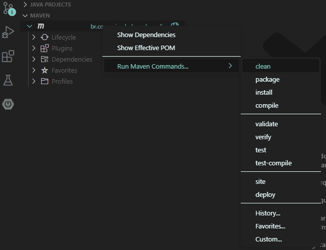
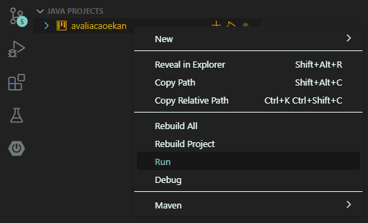
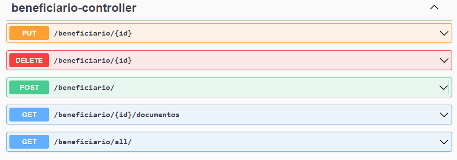
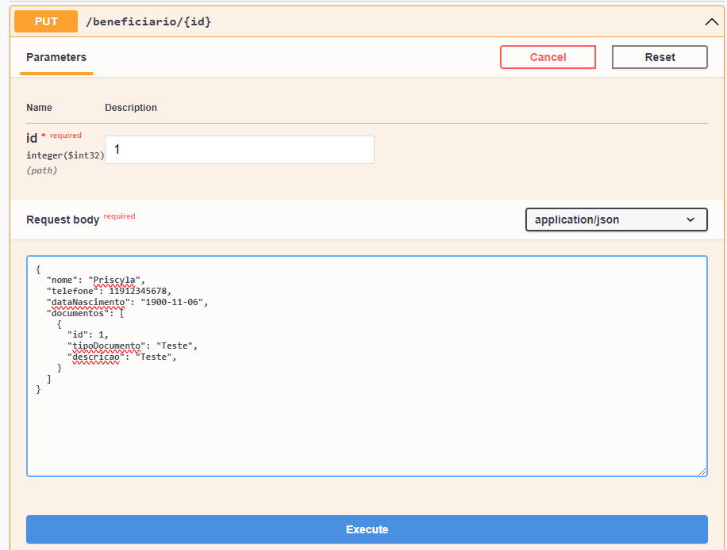

# API Beneficiários
Projeto de envio para avaliação da empresa Ekan, a proposta é criar uma aplicação para manter cadastro de beneficiários de um plano de saúde.

### 💻 Tecnologias e Software utilizadas


### Como executar
- Realizar o clone do repositório, abrir o GitBash no local da pasta que desejar e digitar o comando: 
```
git clone https://github.com/priscyladepaula/api-beneficiarios-java.git
```
- Se estiver usando algum IDE Eclipse, Intellij, Netbeans, realize a limpeza e a compilação do projeto antes de iniciar na classe main.
- Caso usar o Visual Studio Code, vá pelo explorador ao lado esquerdo > <i>Maven Projects</i> > clicar com botão direito em cima do nome do projeto > <i>Run Maven Commands...</i> > <i>clean</i>. Repetir o mesmo caminho e vai em <i>compile</i>:

Para executar, no mesmo lado, ir para <i>Java Projects</i> > clicar no botão direito > <i>Run</i>:

<br>
### Via Local com Swagger
- Após executar o projeto, abrir o http://localhost:8080/swagger-ui/index.html, que aparecerá na própria interface todos os métodos para construção dos JSONs.


### Via Local:
- Utilizar qualquer ferramenta que faça requisições HTTP (Postman, Inmsomnia, APIDog), e criar as requisições usando o http://localhost:8080/

### Requisições
- <b>POST:</b> url/beneficiario/: realizará o cadastro do beneficiário, juntamente com seus documentos. O documento pode ser mais de um. A funcionalidade dele foi utilizado <b>OneToMany</b>, para cenário de 1 para muitos, como apresentado no diagrama da proposta da empresa;
- <b>GET:</b> url/beneficiario/all/: Retorna somente os cadastro dos beneficiários. Nesta foi necessária a construção de um DTO, para separar as informações de cadastro do beneficiário com as categorias;
- <b>GET:</b> url/beneficiario/{id}/documentos: Retorna somente os documentos do beneficiário cadastrado pelo seu id.
- <b>DELETE:</b> url/beneficiario/{id}: Deleta o cadastro do beneficiário pelo seu id.
- <b>PUT:</b> url/beneficiario/{id}: Atualiza o cadastro do beneficiário, juntamente com os documentos a partir de seu id. As variáveis <b>dataInclusao e dataAlteracao</b> entendem-se que são datas no qual o beneficiário foi cadastrado e quando o mesmo foi alterado. Então estes foram tratados com <b>CreatedAt</b> e <b>UpdatedAt</b>, usando o tratamento <b>Schema</b> do OpenAPI, para não aparecerem e assim serem necessários a edição manual no body, podendo assim acessá-los somente ao solicitar a listagem deles. <br><br>
<b>Atenção:</b> Na feramenta desktop que utilizar para realizar as requisições, o body precisa estar exatamente igual a este JSON de exemplo, para reconhecer o id do beneficiário e o(s) id(s) dos documentos.

```json

{
  "nome": "Priscyla",
  "telefone": 11912345678,
  "dataNascimento": "1900-11-06",
  "documentos": [
    {
      "id": 1,
      "tipoDocumento": "Teste",
      "descricao": "Teste"
    },
    {
      "id": 2,
      "tipoDocumento": "Teste",
      "descricao": "Teste"
    }
  ]
}

```
<br> No caso do Swagger, não é necessário manter o id do beneficiário, pois já é solicitado na própria interface, portanto é preciso manter somente o(s) id(s) do(s) documento(s):

